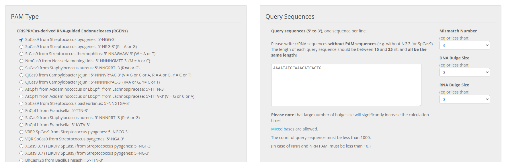
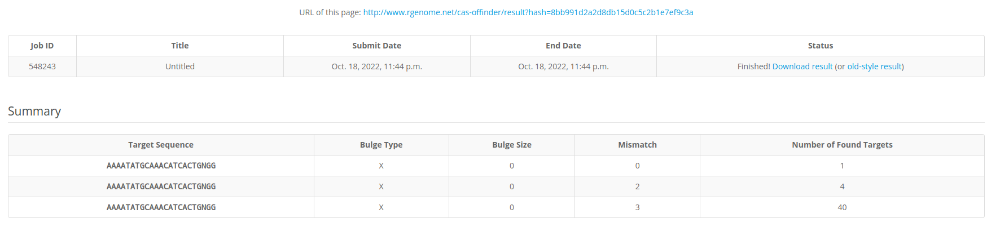
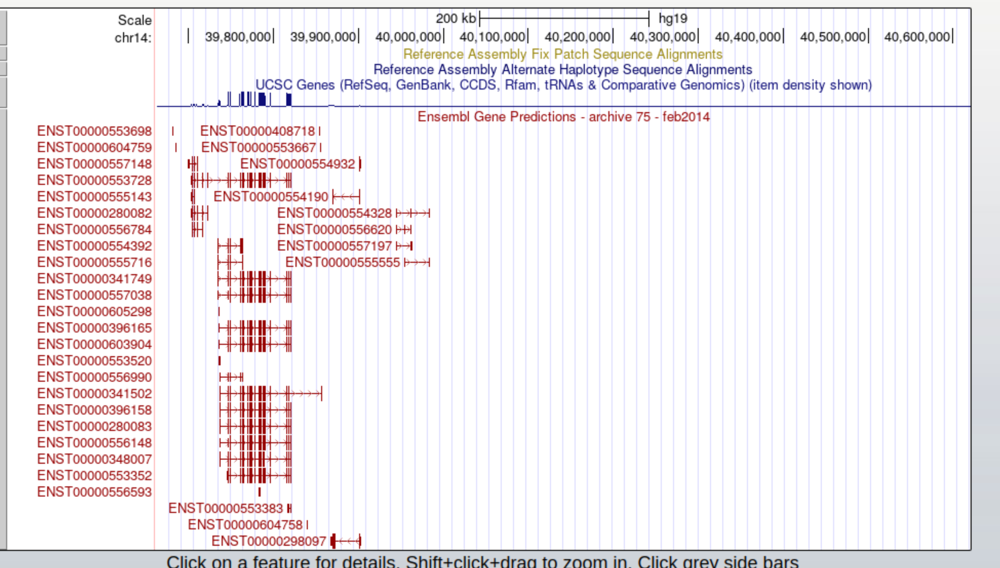
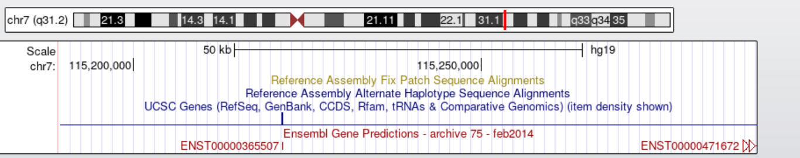

```{r setup, include=FALSE}
knitr::opts_chunk$set(echo = FALSE)
knitr::opts_chunk$set(error = FALSE)
knitr::opts_chunk$set(warning = FALSE)
knitr::opts_chunk$set(message = FALSE)
library(tidyverse)
library(magrittr)
library(png)
library(kableExtra)
knitr::clean_cache()
knitr::fig_path("~/Gill_Tapestri/images/")
```


## Experiment summary

The intended experiment will use catalytically-inactivated spCAS9 (dCAS9) attached to an adenine deaminase (in other words, a gen8 A-Base-Editor, ABE8) to edit CD45 in AML patient samples, and then use Tapestri single-cell DNA sequencing to characterize clonal populations while quantifying off-target base-editing. The amplicons for the Tapestri panel will include the standard AML clonal markers, in addition to the target sequence and the potential off-target sequences.

## Acquiring Off-Target Sites

In this report I will show how to get the off-target sites for CD45 from "rgenome.net", annotate the target data, and convert the annotated target data for compliance with MissionBio's Mosaic Template Editor requirements.

### CRISPR RGEN Tools at regenome.net


<br>

#### CAS-OFFinder Query

CAS-OFFinder is, per the site, "A fast and versatile algorithm that searches for potential off-target sites of Cas9 RNA-guided endonucleases... Cas-OFFinder searches for potential off-target sites in a given genome or user-defined sequences. Unlike other algorithms currently available for identification of RGEN off-target sites, Cas-OFFinder is not limited by the number of mismatches and allows variations in protospacer-adjacent motif sequences recognized by Cas9, the essential protein component in RGENs. Cas-OFFinder is available as a command-line program or accessible via our website: http://www.rgenome.net/cas-offinder." [@casoff]

The target sequence is: <p style="color:red">AAAATATCAAACATCACTGNGG</p>

Note that the <span style="color:red">NGG</span> is omitted from the tail end of the sequence, as per the instructions. There are a huge number of low-likelihood off-target sites that have more than 3 mismatches, and it would be currently unfeasible using single-cell DNA sequencing to account for all of them. The max number of mismatches was set to 3. DNA and RNA bulge size were left at default.



<br>



<br>

## Data Annotation

The results of the query with up to 2 mismatches were downloaded to a text file. They were read into R with some slight alterations in formatting. Here is a preview of what was contained in the results file:

```{r echo = TRUE}
#Read in data
Targets <- read.delim("Targets.txt")
#Subset Data by sites with 2 or less mismatches
Targets <- tibble(subset(Targets, subset = Targets$Mismatches <= 2))
#remove columns unnecessary for Tapestri Amplicon Panel Designer, and match the downstream query for merging
Targets %<>%
  dplyr::select('Chromosome', 'Position', 'Direction', 'DNA', 'crRNA', 'Mismatches') %>%
  mutate_all(~gsub("chr", "", .)) %>%
  rename(chromosome_name = 'Chromosome') %>% 
  rename(strand = 'Direction') 
#Format for downstream merging
Targets$Position <- as.integer(Targets$Position)
Targets$strand <- gsub(x = Targets$strand, pattern = "+", replacement = "1", fixed = TRUE)
Targets$strand <- gsub(x = Targets$strand, pattern = "-", replacement = "-1", fixed = TRUE)
Targets$strand <- as.integer(Targets$strand)
#View(Targets)
head(Targets) %>%
  kbl() %>%
  kable_styling(bootstrap_options = c("striped", "hover", "condensed"))
```

<br>

The Tapestri amplicon designer requires a specific format to the CSV, described here: https://support.missionbio.com/hc/en-us/articles/360038037893 

For submitting, the necessary identifiers are: gene, region, dbSNP, COSMIC, and HGVS. The target site is, by design, within the PTPRC (CD45) gene locus. The off target sites, however, need to be associated with their respective genes in addition to the other identifiers. This can be achieved using biomaRt's ensembl API, and the IRanges package for determining if the target is between the start and end of each gene. 

<br>

### biomaRt

Presented below is the code to generate a biomaRt mart object with data from ensembl about all genes, and a preview of the table. The selected attributes for the query are p style="color:red">"chromosome_name", "strand", "start_position", "end_position", "hgnc_symbol", "percentage_gene_gc_content", and "description".</p> These are necessary for producing the ranges to cross-reference with the target sites from CAS-Offinder. 


```{r echo = TRUE, cache=TRUE}
#Use biomaRt to generate metadata
require(biomaRt)
ensembl <- useMart("ensembl", dataset="hsapiens_gene_ensembl")
attr <- c("chromosome_name", "strand", "start_position", "end_position", "hgnc_symbol", "description")
bm <- getBM(attributes = attr, mart = ensembl)
head(bm)%>%
  kbl() %>%
  kable_styling(bootstrap_options = c("striped", "hover", "condensed"))
```
### IRanges

This package creates a range object from corresponding pairs of values to set a range. By doing this, the off-target sequences' positions can be tested if they are within the range of the start and end positions listed with each gene from biomaRt. I created a custom function to use a single-digit "range" object for this application called "is_X_between_Y_n_Z." Wrapped within the function is the appropriate renaming of the output values for downstream merging:

```{r echo = TRUE}
#create function for finding matches for targets within gene ranges
is_X_between_Y_n_Z <- function(x, y, z) {
  #dependencies
  require(IRanges)
  #create single-digit IRanges object
  x = IRanges(x)
  #create IRanges object from start and end numbers
  r = IRanges(start = y, end = z)
  #return only y and z pairs that correspond to positive matches with x
  Ans = IRanges::as.data.frame(IRanges::findOverlapPairs(x, r, type = "within"))
  return(Ans)
}
is_X_between_Y_n_Z(Targets$Position, bm$start_position, bm$end_position) -> Pairs
#Format Pairs Table and remove unnecessary columns
Pairs %>% 
  dplyr::select('first.start', 'second.start', 'second.end') -> Pairs
#rename columns
Pairs %>% 
  rename(first.start = 'Position') %>%
  rename(second.start = 'start_position') %>% 
  rename(second.end = 'end_position') -> Pairs
head(Pairs)%>%
  kbl() %>%
  kable_styling(bootstrap_options = c("striped", "hover", "condensed"))
```

<br>

Note that there are more than five outputs. At this point, whether it is on the positive or negative strand and the chromosome number has not been taken into account. These issues, however, are solved due to the formatting of the dataframes earlier in the pipeline upon using the dplyr join functions with respect to the matching variable names.

<br>

### dplyr "join" functions

Once a table of range information is generated, all that is left is to combine the annotations from biomaRt with that, and then add only the metadata necessary for the five pre-defined potential off-target sites.


```{r echo = TRUE}
#Combine Pair info with biomaRt annotations
left_join(Pairs, bm, by = c('start_position', 'end_position')) -> Pairs
#Combine Target info with Pairs Info
left_join(x = Targets, Pairs, by = c('Position', 'strand', 'chromosome_name')) -> Targets
# View(Targets)
Targets%>%
  kbl() %>%
  kable_styling(bootstrap_options = c("striped", "hover", "condensed"))
```

<br>

## Novel Transcript and Un-annotated site

Through this process, it has become apparent that two of the four potential off-target sites do not reside in a known gene. For the novel transcript, it could be that the gene is yet unknown at the site. For the result with missing annotations, it could be an error, or it could be an intronic region, wherein there are no gene annotations to be added. From the USCS Genome Browser:



<br>



<br>


## Conclusion

We may not need to request the novel transcript or the unnannotated site for amplicons on the panel. It may be more useful to reproduce this analysis including the 40 or so off-target sites with 3 mismatches and see if similar results occur and if the number of amplicons is feasible for those sites as well.

<br>

## References


